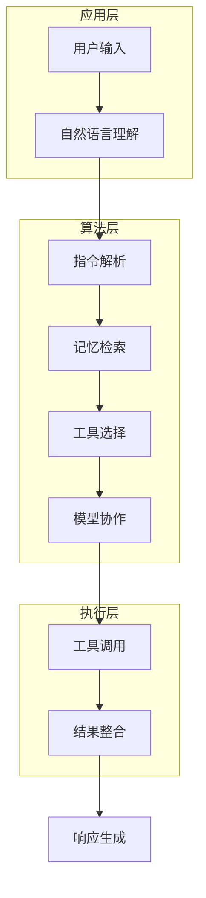
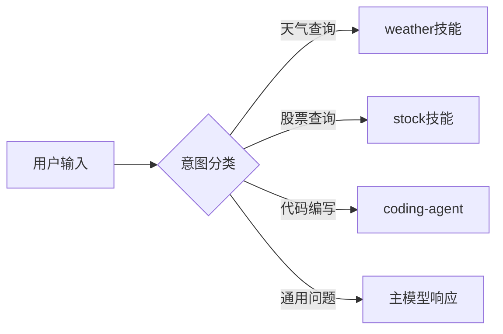
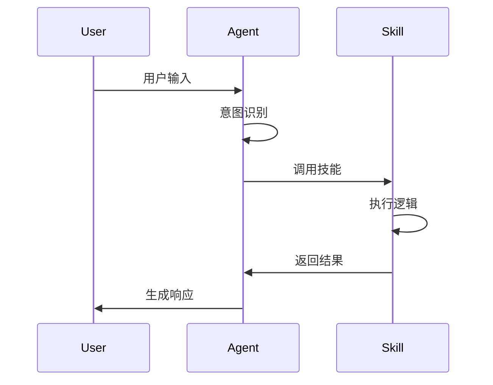

# OpenClaw AI算法架构解读

<callout emoji="🤖" background-color="light-blue">
本文档从NLP算法工程师视角解读OpenClaw框架的核心AI技术，重点分析语言理解、记忆系统、模型编排等算法层面的设计思路。
</callout>

---

## 📋 文档说明

| 项目 | 内容 |
|------|------|
| 目标读者 | NLP算法工程师、AI研究员 |
| 技术深度 | 算法架构层面，不涉及工程实现细节 |
| 适用场景 | AI技术分享、算法架构讨论 |

---

## 1. 整体架构概览

OpenClaw作为一个本地优先的AI代理框架，其核心算法架构可以分为三个层次：



---

## 2. 核心算法模块

### 2.1 自然语言理解（NLU）

#### 2.1.1 意图识别

OpenClaw通过关键词匹配和语义分析相结合的方式进行意图识别：

<grid cols="2">
<column>

**规则匹配**
- 关键词触发特定技能
- 例如："天气" → weather技能

</column>
<column>

**语义分析**
- 使用embedding模型理解用户意图
- 支持多轮对话上下文理解

</column>
</grid>

<callout emoji="💡" background-color="light-yellow">
**算法要点**：OpenClaw采用混合策略，规则匹配保证响应速度，语义分析提升理解准确率。
</callout>

#### 2.1.2 实体抽取

从用户输入中提取关键参数：

```python
# 示例：用户输入"北京天气怎么样"
# 实体抽取结果：
# {
#   "location": "北京",
#   "intent": "query_weather",
#   "time": "current"  # 默认当前时间
# }
```

---

### 2.2 记忆系统

#### 2.2.1 向量检索

OpenClaw使用语义搜索来检索历史对话和知识：

```
用户查询 → Embedding → 向量相似度计算 → 检索Top-K结果
```

**算法特点**：
- 语义相似度而非关键词匹配
- 支持多轮对话上下文关联
- 记忆持久化存储

#### 2.2.2 记忆索引

| 记忆类型 | 存储内容 | 检索方式 |
|----------|----------|----------|
| 对话记忆 | 历史对话记录 | 语义相似度 |
| 用户偏好 | 回复风格、称呼习惯 | 关键词匹配 |
| 项目信息 | 工作空间、配置信息 | 精确匹配 |

---

### 2.3 模型编排

#### 2.3.1 多模型协作

OpenClaw支持多个AI模型协同工作：

<grid cols="3">
<column>

**主模型**
- 默认响应生成
- 理解用户意图

</column>
<column>

**子模型**
- 特定任务处理
- 例如：代码生成

</column>
<column>

**工具调用模型**
- API协商与调用
- 结果解析

</column>
</grid>

#### 2.3.2 路由策略



---

## 3. 关键算法技术

### 3.1 对话管理

#### 3.1.1 上下文维护

OpenClaw使用以下机制维护对话上下文：

- **短期记忆**：当前会话的对话历史
- **长期记忆**：用户偏好、历史决策
- **工作记忆**：临时变量、中间状态

#### 3.1.2 状态机

对话状态管理采用有限状态机模型：

```
初始状态 → 意图识别 → 技能选择 → 执行 → 响应生成 → 循环/结束
```

---

### 3.2 技能系统

#### 3.2.1 技能发现与选择

<grid cols="2">
<column>

**基于关键词**
- 直接匹配用户输入中的关键词
- 快速响应，准确率高

</column>
<column>

**基于语义**
- 使用embedding匹配技能描述
- 支持模糊匹配

</column>
</grid>

#### 3.2.2 技能执行流程



---

### 3.3 工具调用

#### 3.3.1 函数调用机制

OpenClaw支持MCP（Model Context Protocol）工具调用：

```
自然语言 → 工具选择 → 参数提取 → API调用 → 结果解析
```

**算法步骤**：
1. 意图识别确定需要调用的工具
2. 从用户输入中提取工具参数
3. 调用工具API获取结果
4. 将结果整合到响应中

#### 3.3.2 错误处理

<callout emoji="⚠️" background-color="light-yellow">
**异常处理**：工具调用失败时，系统会记录错误信息并尝试其他方案或向用户反馈错误原因。
</callout>

---

## 4. 算法优化方向

### 4.1 性能优化

| 优化方向 | 算法策略 |
|----------|----------|
| 响应速度 | 缓存机制、并行处理 |
| 准确率 | 混合策略（规则+语义） |
| 可扩展性 | 模块化设计、插件机制 |

### 4.2 算法改进

<grid cols="3">
<column>

**意图识别**
- 引入更先进的NLU模型
- 支持更多语言

</column>
<column>

**记忆系统**
- 优化向量检索算法
- 改进相似度计算

</column>
<column>

**模型协作**
- 动态路由策略
- 负载均衡

</column>
</grid>

---

## 5. 总结

OpenClaw作为一个本地优先的AI代理框架，其算法架构体现了以下特点：

1. **混合策略**：规则匹配与语义理解相结合
2. **模块化设计**：各算法模块职责清晰，易于扩展
3. **本地优先**：数据处理在本地完成，保护隐私
4. **多模型协作**：支持多种AI模型协同工作

<callout emoji="📝" background-color="light-green">
**NLP算法工程师视角**：OpenClaw的架构设计充分考虑了自然语言处理的技术特点，在保证响应速度的同时，通过语义理解提升用户体验。
</callout>
